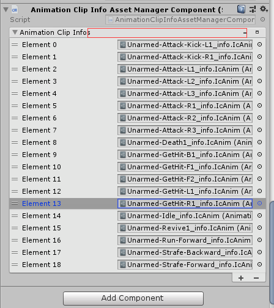

The addition before the 1.1.0 version can only be added in the way of the path, there presence restriction, so after the 1.1.0 version changed to the custom list add

The red marker box area is to select multiple resource files and drag to the location to add range. Support multiple selection operations, press `shift` to select multiple selections.

thank [`Unity-Reorderable-List`](https://github.com/cfoulston/Unity-Reorderable-List)