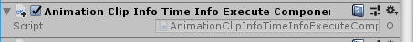
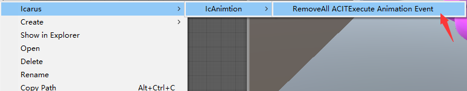

Before the 1.0.9 version, the event Need to be in module editor add. All the time points need to be added. At the same time the meta file of the AnimationClip will be modified. If the project does not synchronize the meta file, then the runtime will have no reaction.
So after version 1.0.9, it becomes added at runtime. Before version 1.1.0, this logic was in the `AnimationClipInfoAssetManagerComponent` component, 1.1.0 was added to the `TimeInfoExecuteComponent` component.Also more in line with the design, because it should not be necessary

For users before version 1.0.9, if you want to delete the added animation event, you can select the animation right button `Icarus/IcAnimation/RemoveAll ACITExecute Animation Event` to delete,support multiple selection.

