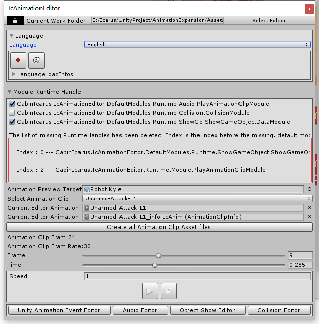

The wireframe mark that tells that it was deleted of runtime, because it was not found. It is used to fix the RuntimeHandle loss problem. When the namespace or the RuntimeHandle class name is modified or delete RuntimeHandle class appear. After closing the IcAnimationEditor or switching the animation,Will not display
